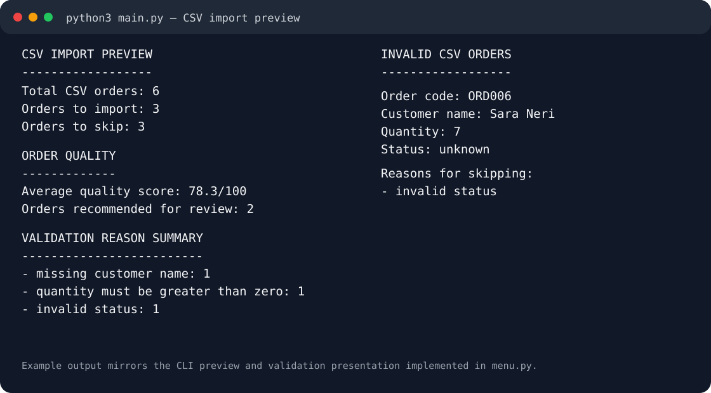

# Order Integrity Checker


Order Integrity Checker is a Python portfolio project for validating, importing, reviewing, and managing business orders stored in SQLite. It models a realistic data-quality workflow: incoming CSV records are normalized, validated, checked for suspicious duplicates, scored for quality, and either accepted or reported with actionable suggestions.

The same application logic is reused by a CLI, a responsive Tkinter desktop interface, and an optional FastAPI REST API.

## Why this project

The project focuses on software-engineering practices that transfer to production backend and internal-tool work:

- layered application design and reusable services
- relational SQLite persistence and schema migration
- input normalization and validation
- explainable data-quality scoring
- suspicious duplicate detection
- suggested fixes for invalid records
- transactional status history
- safe database backup and restore
- CLI, Tkinter GUI, and REST interfaces over shared business logic
- automated tests, linting, coverage enforcement, and GitHub Actions CI

## Visual example

### CLI validation preview



The visual above mirrors the labels and structure generated by the CLI preview code in `menu.py`. The SVG is stored as text so documentation changes remain reviewable in Git diffs.

A real GUI capture is intentionally not replaced with a mockup. The reproducible capture process and asset rules are documented in [`docs/screenshots.md`](docs/screenshots.md) and [`docs/images/README.md`](docs/images/README.md).

## Core features

### Order integrity

- Normalize order codes, customer names, quantities, and statuses before validation.
- Reject missing fields, unsupported statuses, invalid quantities, duplicate CSV codes, and codes already present in the database.
- Detect suspicious near-duplicate orders without automatically rejecting them.
- Calculate explainable quality scores and flag records that deserve review.
- Generate suggested fixes for malformed codes, misspelled statuses, whitespace problems, and unusual quantities.
- Preview CSV imports before any persistent change is made.
- Import valid rows only after explicit confirmation and report skipped rows with reasons.

### Persistence and recovery

- Store customers separately from orders and reuse normalized customer records.
- Migrate the legacy embedded-customer schema automatically.
- Record every real order-status transition with timestamped history.
- Preserve status history after an active order is deleted.
- Create timestamped SQLite backups, list them, validate them before restore, and preserve the current database when validation fails.

### Interfaces

- Interactive CLI for importing, searching, creating, updating, deleting, exporting, and inspecting orders.
- Dedicated CLI tools for customer browsing, order filtering, status history, and database recovery.
- Responsive Tkinter GUI with separate cards for search, creation, update, deletion, database browsing, customers, CSV import, statistics, and output.
- FastAPI REST API with structured request/response schemas and endpoints for orders, customers, and status history.

## Technologies

Runtime and application:

- Python
- SQLite
- CSV
- Tkinter / ttk
- FastAPI
- Pydantic
- Uvicorn

Development quality:

- `unittest`
- Ruff
- Coverage.py
- GitHub Actions

## Project structure

```text
order_integrity_checker/
├── .github/workflows/tests.yml
├── docs/
│   ├── images/
│   │   ├── README.md
│   │   └── cli-validation-example.svg
│   ├── screenshots.md
│   ├── csv_import_preview.md
│   ├── customer_management.md
│   ├── database_recovery.md
│   ├── gui_layout.md
│   ├── gui_manual_test_checklist.md
│   ├── order_detail_view.md
│   ├── order_quality_scoring.md
│   ├── rest_api.md
│   ├── status_history.md
│   ├── suggested_fixes.md
│   └── suspicious_duplicate_detection.md
├── tests/
├── api.py
├── api_schemas.py
├── backup_service.py
├── config.py
├── csv_import_preview.py
├── csv_manager.py
├── customer_browser_cli.py
├── customer_view.py
├── database.py
├── duplicate_detector.py
├── gui.py
├── main.py
├── menu.py
├── normalizer.py
├── order_browser_cli.py
├── order_query_service.py
├── order_view.py
├── quality_scorer.py
├── recovery_cli.py
├── services.py
├── status_history_cli.py
├── suggestion_engine.py
├── ui_components.py
├── ui_config.py
├── validator.py
├── pyproject.toml
├── requirements-dev.txt
└── README.md
```

Generated application data such as `orders.db`, backup files, validation reports, exported CSV files, coverage output, and tool caches are ignored by Git.

## Validation rules

An incoming order is invalid when any required business rule fails, including:

- missing order code
- malformed order code
- order code already present in SQLite
- duplicate order code inside the same CSV import
- missing or too-short customer name
- missing, non-numeric, zero, or negative quantity
- unsupported status

Supported statuses are:

```text
completed
pending
cancelled
```

## Example CSV input

```csv
order_code,customer_name,quantity,status
ORD001,Mario Rossi,12,completed
ORD003,Anna Verdi,3,pending
ORD004,,5,completed
ORD005,Luca Bianchi,0,pending
ORD006,Sara Neri,7,unknown
ORD003,Paolo Gialli,4,completed
```

## Run the application

### CLI

```bash
python3 main.py
```

The CLI opens the main interactive menu. Before importing CSV rows it shows counts, quality scores, grouped validation reasons, per-order errors, and suggested fixes, then requires confirmation before changing persistent data.

Additional CLI entry points include:

```bash
python3 customer_browser_cli.py
python3 order_browser_cli.py
python3 status_history_cli.py
python3 recovery_cli.py
```

### GUI

```bash
python3 gui.py
```

The Tkinter interface reuses the same service layer as the CLI. It supports searching, creating, updating, deleting, importing, browsing customers and orders, and viewing statistics. Layout details are in [`docs/gui_layout.md`](docs/gui_layout.md), with a manual regression checklist in [`docs/gui_manual_test_checklist.md`](docs/gui_manual_test_checklist.md).

### REST API

Install the project dependencies, then run:

```bash
python3 -m uvicorn api:app --reload
```

FastAPI exposes generated OpenAPI documentation while the routes reuse the existing application services instead of duplicating SQL or business rules. See [`docs/rest_api.md`](docs/rest_api.md) for endpoint details and examples.

### Database recovery

```bash
python3 recovery_cli.py
```

The recovery workflow creates timestamped database backups and validates a selected backup before replacing the active database. Restore requires explicit confirmation. See [`docs/database_recovery.md`](docs/database_recovery.md).

## Development quality checks

Install development tools:

```bash
python3 -m pip install -r requirements-dev.txt
```

Run linting:

```bash
python3 -m ruff check .
```

Run the full test suite with coverage:

```bash
python3 -m coverage run -m unittest discover -s tests -v
python3 -m coverage report
```

Run tests without coverage:

```bash
python3 -m unittest discover -s tests -v
```

GitHub Actions runs linting, tests, and coverage checks on pushes and pull requests. The configured coverage threshold protects the core non-GUI modules while interactive interface code is validated separately.

## Documentation

Feature-specific design notes live under `docs/`, including CSV preview behavior, customer normalization, order detail views, quality scoring, duplicate detection, suggested fixes, status history, REST API usage, database recovery, GUI behavior, and screenshot maintenance.

## Purpose

This project is part of a practical Python learning path and is intentionally built as a recruiter-facing example of incremental software engineering: each feature is represented by a focused issue, implementation, automated validation where appropriate, and documentation that explains the design decisions.
